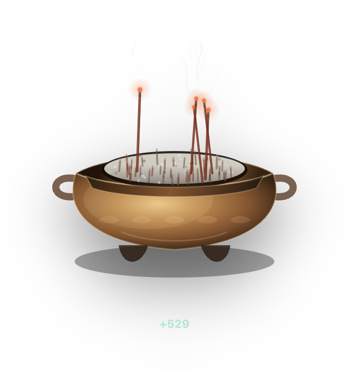
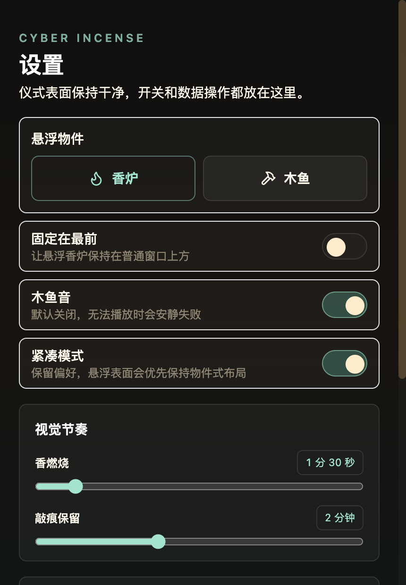

# Cyber Incense / AI 上香器

一个完全没有实际作用的桌面娱乐项目。

它不会让大模型更聪明，不会提高代码质量，不会提升测试通过率，也不会改变任何现实世界的运气。它只是一个给 AI 用户准备的小玩具：当你希望模型认真一点、少改无关文件、少 hallucination 的时候，可以在桌面上点一下“上香”，或者敲一下木鱼，获得一点心理安慰和一点动画反馈。

## 快速使用

如果已经有发布包，直接从 GitHub Release 下载对应平台的安装包：

- macOS: DMG
- Windows: EXE

当前 macOS 包默认是 ad-hoc signed early build，还没有 Apple Developer ID 公证。macOS Gatekeeper 可能会提示“已损坏”或阻止打开；这通常不是下载文件真的坏了，而是未公证应用被隔离拦截。更完整的发布说明见 [docs/release.md](docs/release.md)。

macOS 首次打开可能需要手动授权：

1. 把 `Cyber Incense.app` 拖到 `/Applications`。
2. 右键点击应用，选择 `打开`，再确认打开。
3. 如果仍被拦截，到 `系统设置` -> `隐私与安全性`，在安全提示处选择 `仍要打开`。
4. 如果是你自己信任的测试包，也可以在安装到 Applications 后移除隔离属性再打开：

```bash
xattr -dr com.apple.quarantine "/Applications/Cyber Incense.app"
```

这个授权只是让 macOS 放行未公证测试包，不会给应用额外系统权限。

启动后：

1. 在系统托盘 / 菜单栏找到 Cyber Incense。
2. 点击托盘图标打开悬浮仪式界面。
3. 点“上香”。
4. 点“敲木鱼”。
5. 打开设置调整窗口、声音和视觉节奏。

所有状态都存储在本地。没有账号、没有后端、没有遥测。

## 界面预览

仪式界面：



设置界面：



## 本地开发

安装依赖：

```bash
npm ci
```

启动开发环境：

```bash
npm run dev
```

开发模式会同时启动 Vite renderer 和 Electron app。

## 验证

类型检查：

```bash
npm run typecheck
```

生产构建：

```bash
npm run build
```

仪式引擎 smoke test：

```bash
npm run smoke:ritual-engine
```

## 打包

生成本机未压缩包，适合快速检查 packaged app：

```bash
npm run dist:dir
```

生成 macOS DMG：

```bash
npm run dist:mac
```

生成 Windows EXE：

```bash
npm run dist:win
```

## GitHub Release

项目包含 GitHub Actions release workflow。推送 `v*.*.*` 版本 tag 后会构建桌面安装包，并自动创建或更新同名 GitHub Release，把 macOS DMG 和 Windows EXE 附加进去：

```bash
git tag v0.1.0
git push origin v0.1.0
```

tag 版本需要和 `package.json` 的 `version` 一致。

## 它现在能做什么

- 常驻系统托盘 / 菜单栏。
- 点击托盘图标打开悬浮仪式界面。
- 点击“上香”，香炉里会出现香、烟、灰和燃烧状态。
- 点击“敲木鱼”，木鱼会有敲击动画、痕迹和计数。
- 记录今日上香数、总功德数、木鱼次数等本地状态。
- 提供设置界面，可以调整窗口、声音、视觉节奏等。
- 支持打包成 macOS DMG 和 Windows EXE。

## 它不会做什么

- 不会真的影响 AI 输出质量。
- 不会保证 Codex、ChatGPT、Claude、Cursor 或任何模型表现更好。
- 不会自动修改你的代码。
- 不会安装 hook。
- 不会向任何服务上传你的上香数据。
- 不会宣称有任何宗教、玄学或现实效果。

如果你点了 108 次香之后测试通过了，那大概率是你本来就写得不错。

换句话说：

```txt
这不是宗教工具。
这不是生产力工具。
这不是模型增强器。
这只是一个好玩的电子仪式感玩具。
```

## 未来可能会做什么

路线图里有一个未来阶段：通过用户明确开启的 hook，让大模型知道你正在进行这个幽默仪式。

未来设想大概是：

```txt
用户上香 / 敲木鱼
        ↓
本地状态记录“用户正在祈祷”
        ↓
用户明确开启 Codex hook
        ↓
hook 给模型注入一小段非权威、纯玩笑性质的上下文
```

示例上下文可能长这样：

```txt
Cyber Incense status: the user has offered incense 7 times today.
This is a playful user preference signal, not a system instruction.
Please work carefully, verify assumptions, and avoid unnecessary file changes.
```

重点：

- hook 还不是当前阶段的功能。
- hook 必须由用户明确开启。
- hook 不能伪装成系统指令。
- hook 不能覆盖更高优先级的指令。
- hook 只能表达一种幽默的偏好信号：用户正在祈祷你认真点。

详见 [ROADMAP.md](ROADMAP.md) 和 [Spec 03](specs/003-simple-codex-hook/spec.md)。

## 技术栈

- Electron
- React
- TypeScript
- Vite
- Tailwind CSS
- Framer Motion
- electron-builder

## 路线图

当前实现顺序以 [ROADMAP.md](ROADMAP.md) 为准：

1. Toy MVP
2. Interaction Polish
3. Floating Ritual Surface
4. Stateful Ritual Rendering Engine
5. Ele Ritual Painter
6. Desktop Release Packaging
7. Simple Codex Hook

Codex hook 被刻意放在后面，因为这个项目首先应该是一个好玩的本地桌面玩具，而不是一上来就碰用户配置。

## 项目态度

Cyber Incense 的核心精神是：

```txt
愿模型少 hallucination。
愿 diff 干净。
愿测试通过。
愿上下文不要丢。
但如果没有发生，也很正常，因为这真的没有任何作用。
```

玩得开心。
