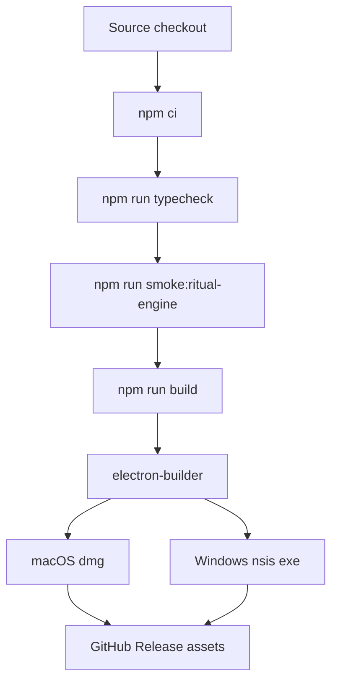

# Implementation Plan: Desktop Release Packaging

**Branch**: `007-desktop-release-packaging` | **Date**: 2026-04-28 | **Spec**: [spec.md](spec.md)  
**Input**: Feature specification from `/specs/007-desktop-release-packaging/spec.md`

## Summary

Add desktop release packaging for Cyber Incense using the existing Electron/Vite production build as input. The first implementation should produce unsigned macOS and Windows artifacts locally and through GitHub Actions tag builds, then attach those artifacts to a GitHub Release.

The implementation should be deliberately small:

```txt
npm run build
└─ electron-builder
   ├─ macOS: dmg
   └─ Windows: nsis exe
```

Code signing and notarization are prepared as extension points, but unsigned early-access packaging must work without secrets.

## Technical Context

**Language/Version**: TypeScript 5.7, Electron 41, React 18, Vite 6  
**Primary Dependencies**: Electron, Vite, React, Tailwind, Framer Motion  
**Packaging Candidate**: electron-builder  
**Storage**: Existing local JSON store through Electron main process  
**Testing**: `npm run typecheck`, `npm run build`, `npm run smoke:ritual-engine`, packaged-app manual smoke  
**Target Platform**: macOS first, Windows second, Linux later  
**Project Type**: Desktop app with Electron main/preload plus Vite renderer  

## Constitution Check

- **Local-first**: Packaging must not introduce backend services, accounts, or telemetry.
- **Hook-safe**: This spec must not install or modify Codex hook files or Codex configuration.
- **Existing behavior preserved**: Dev mode and current production build must remain functional.
- **Conservative changes**: Add release tooling and metadata without refactoring ritual simulation or rendering.
- **Verifiable**: Every release command should have a matching validation command or manual smoke checklist.

## Project Structure

### Current Relevant Paths

```txt
package.json
package-lock.json
electron/
src/
scripts/generate-icons.mjs
scripts/ritual-engine-smoke.mjs
assets/
```

### Proposed New/Changed Paths

```txt
package.json                         # package scripts and optional build config
electron-builder.yml                 # preferred packaging config location
.github/workflows/release.yml        # GitHub tag release workflow
docs/release.md                      # release operation notes, if docs/ exists or is introduced
assets/icons/                        # generated icns/ico/png if current assets are insufficient
```

## Architecture



## Implementation Phases

### Phase 1: Packaging Baseline

Add the packaging dependency, config, app identity, artifact naming, included files, and platform targets. Keep output under a predictable release directory such as `release/`.

### Phase 2: Local Commands

Add npm scripts for platform packaging:

```txt
dist
dist:mac
dist:win
dist:dir
```

Each command should use the existing production build as input and should be easy to run from a clean checkout.

### Phase 3: Icon And Metadata Validation

Verify the app has platform-appropriate icons and installer metadata. Extend `scripts/generate-icons.mjs` or add assets only if the current icon set is not enough.

### Phase 4: GitHub Actions Release

Add a tag-triggered workflow that runs validation, builds platform artifacts on native runners, and uploads assets to GitHub Releases.

### Phase 5: Release Documentation And Smoke

Document local packaging, CI release, unsigned-app warnings, and a manual packaged-app smoke checklist.

## Risk Register

- **R1: Packaged renderer path mismatch**  
  Mitigation: Run packaged app outside dev mode and verify it uses local `dist/index.html`.

- **R2: Missing icons produce ugly or broken artifacts**  
  Mitigation: Validate `.icns`, `.ico`, and tray icon assets during packaging setup.

- **R3: Unsigned app warnings confuse testers**  
  Mitigation: Document early-access status and future signing path in release notes.

- **R4: CI release upload permissions fail**  
  Mitigation: Set explicit workflow permissions and use the default `GITHUB_TOKEN`.

- **R5: Cross-platform packaging assumptions fail**  
  Mitigation: Build macOS on macOS runner and Windows on Windows runner.

## Complexity Tracking

No constitution violations are expected. Signing, notarization, auto-update, and app-store distribution are intentionally deferred.

## Verification Plan

1. Run `npm run typecheck`.
2. Run `npm run smoke:ritual-engine`.
3. Run `npm run build`.
4. Run local platform packaging command.
5. Launch packaged app and verify:
   - tray/menu bar icon appears
   - ritual surface opens
   - 上香 increments and animates
   - 木鱼 increments and animates
   - visual settings persist after relaunch
6. Push a test tag and verify GitHub Release assets.
